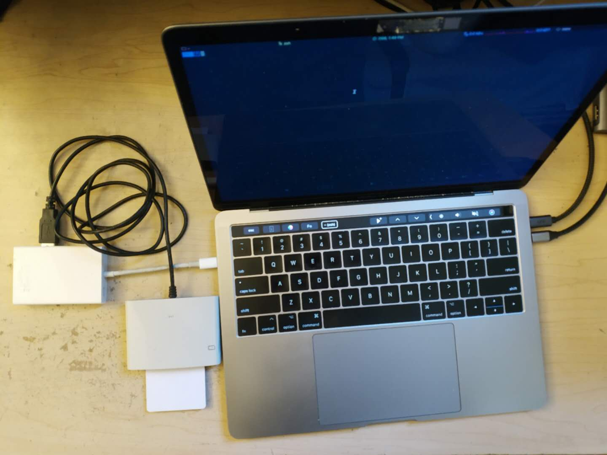

# Flora eSIM Applet

This is an eSIM Applet project based on Javacard. This applet provides basic SIM file 
structure, SIM authentication, and customized 
APDU handling functions. This project belongs to the [Flora].

## Publications
- [Mobicom'21] "SecureSIM: Rethinking Authentication and Access Control for SIM/eSIM". Jinghao Zhao, Boyan Ding, Yunqi Guo, Zhaowei Tan, Songwu Lu.

## Feature List
 - Support read/write standardized/customized SIM structures
 - Support milenage algorithm for SIM authentication

## Usage 
### Javacard reader
The reader is needed for eSIM-Applet and eSIM-Loader to let you install the 
eSIM applet on the Jcard and load profiles into it.

### Overall steps
 - Install the esim.cap file to your Java Card smart card with [GlobalPlatformPro]
 - Use the eSIM-Loader to load the profile

### Install CAP file
Using [GlobalPlatformPro] to install the cap file on your Javacard. 
You can run 
```
./config.sh
```
to download the GlobalPlatform .exe and .jar to folder `GlobalPlatformPro`  
Note: We use the Release v20.01.23 and the latest release may cause unknown issues.

Install the cap file (Linux or MacOS):
```
java -jar ./GlobalPlatformPro/gp.jar --install ./esim.cap --default
```
Install the cap file (Windows):
```
./GlobalPlatformPro/gp.exe --install ./esim.cap --default
```
Note: When you want to reinstall the applet, please delete the old one on the card first by the 
package AID (default package AID is 010203040506070809)
```
java -jar ./GlobalPlatformPro/gp.jar -f --delete 010203040506070809
```
For Windows:
```
./GlobalPlatformPro/gp.exe -f --delete 010203040506070809
```

## Download Source Codes

The source codes are developed and maintained by UCLA WING Lab. 
Please download the latest codes from the [WING CodeShare] page.

## License

eSIM-Applet is Apache 2.0 licensed, as found in the LICENSE file. 

## Citation
If you find this repo useful, please cite our paper.
```
@inproceedings{zhao2021securesim,
  title={SecureSIM: rethinking authentication and access control for SIM/eSIM},
  author={Zhao, Jinghao and Ding, Boyan and Guo, Yunqi and Tan, Zhaowei and Lu, Songwu},
  booktitle={Proceedings of the 27th Annual International Conference on Mobile Computing and Networking},
  pages={451--464},
  year={2021}
}
```

[GlobalPlatformPro]: https://github.com/martinpaljak/GlobalPlatformPro
[Flora]: https://github.com/Project-Flora/Flora
[WING CodeShare]: http://metro.cs.ucla.edu/codeshare.html
